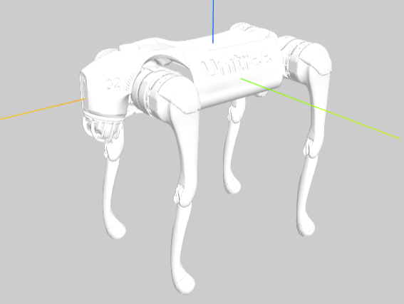
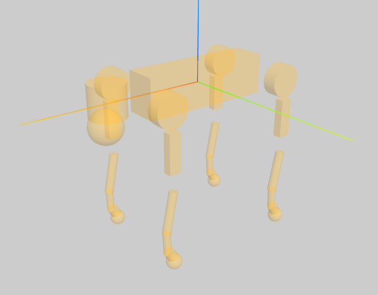
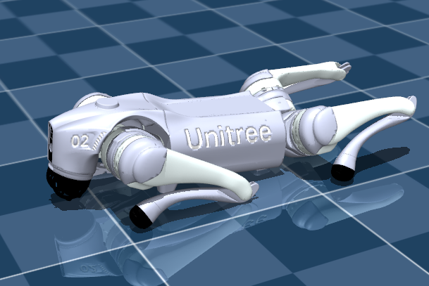
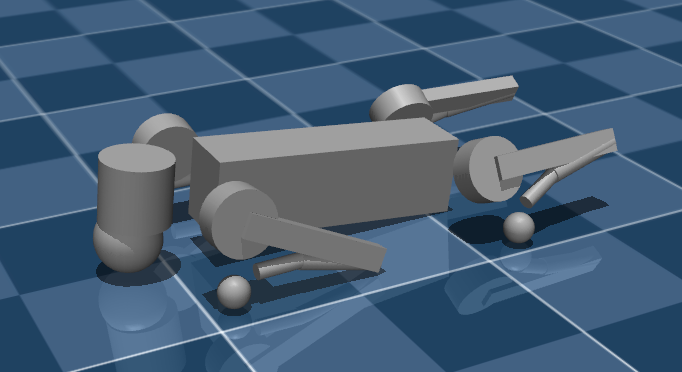
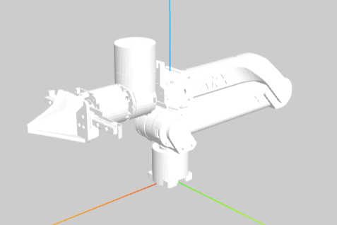
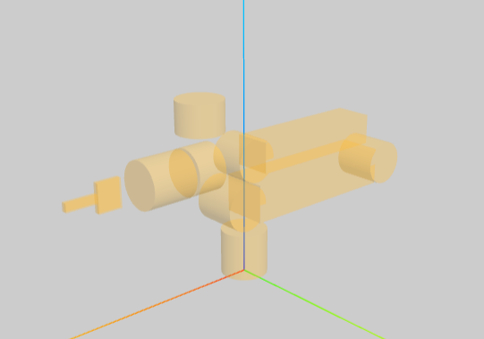
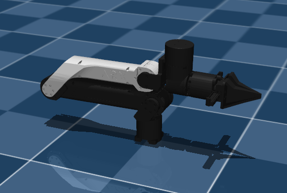
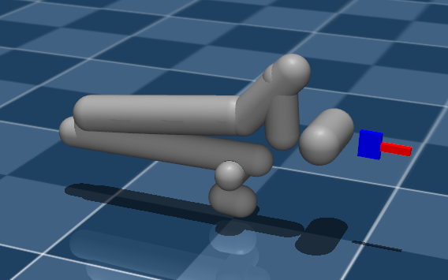
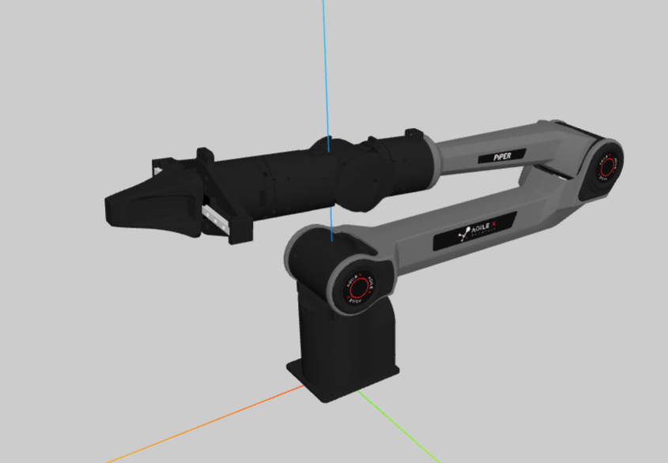
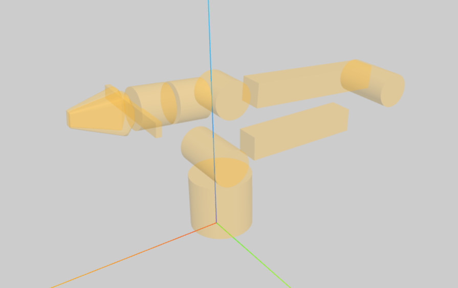

# Robot Gallery

This repository collects robot model assets for MuJoCo and URDF workflows.

For URDF visualization, the recommended option is the VS Code extension [URDF Visualizer](https://github.com/MorningFrog/urdf-visualizer), which can be installed directly from the VS Code marketplace.

## Scripts

Convex decompose an STL with CoACD:

```bash
conda activate robot_gallery
./scripts/convex_decompose_stl.py input.stl --resolution 2000 --max-convex-hull 1
```

Output: `input_convex/input_convex_000.stl`, etc.

## Preview

| Model | URDF Visual | URDF Collision | MJCF Visual | MJCF Collision |
| --- | --- | --- | --- | --- |
| GO2 |  |  |  |  |
| X5 |  |  |  |  |
| piper_l |  |  |  |  |
